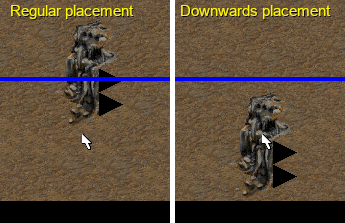
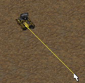

# World-Altering Editor 用户手册

[English](./Manual.md)

本用户手册包含一些有用的提示和技巧。

**注意:** 本手册提及的大部分快捷键，都可以在 *Keyboard Options* 菜单进行自定义。本手册将以默认值进行介绍。

## 绘制地形

要绘制地形，请从顶部栏或屏幕底部的 TileSet 选择器中选择一个地块。然后只需点击就能将其放置在地图上。

**要填充封闭区域**, 请选择一个 1x1 大小的图块，然后在按住 Ctrl 的同时单击该区域。此逻辑类似于微软画图软件、很多其他图像编辑软件或很多其他地图编辑器中的“油漆桶工具”。

### 绘制水面

要绘制水面，请从屏幕底部的 TileSet 选择器中选择 Water TileSet。然后请选择一个地图格子进行绘制。您可以增加笔刷大小以覆盖更大的区域，或使用在上一节中提到的填充功能。

请注意，填充功能仅适用于 1x1 大小的地形块。

### 但是如果我只使用 1x1 的水地形块，我的水岂不是都是一样的？

完成地图细节处理后，您可以运行 *Tools -> Run Script... -> Smoothen Water.cs*。该脚本将随机化地图上的所有水地形块。

### 将地形放置在地图的南部边缘

通常，地形块位于光标上方。因此您在地图的南部边缘放置地形块会很困难。在这种情况下，您可以按住 Alt 键将地形块放置在光标下方，而不是光标上方。

## 复制和粘贴

与大多数程序一样，您可以使用 Ctrl+C 和 Ctrl+V 键启用常规的矩形复制和粘贴功能。当然，您也可以从 Edit 菜单访问它们。

Alt+C 可激活复制自定义形状区域的工具。

### 复制非地形元素

有时，您可能想要复制的不仅仅是地形：建筑物、单位、树木、覆盖物等。您可以从  *Edit -> Configure Copied Objects* 中选择要复制的地图元素。

## 对象

### 旋转单位

要旋转单位，请将鼠标悬停在该单位上。然后**按住**键盘上的 *Rotate Unit* 键（默认：A），并用鼠标将单位拖动到您希望单位朝向的方向。

### 删除对象

删除对象的最快方法是将鼠标光标悬停在对象上，然后按键盘上的 Delete 键。

另一种方法是按 *Deletion Mode* 顶部栏上的按钮。它会激活一个删除光标，然后您可以单击地图上的对象来删除。

### 重叠对象

默认情况下，WAE 会阻止您重叠对象（将多个单位或建筑物放置在同一个格子上）以避免一些意外。这对 泰伯利亚之日 尤其重要，因为如果多个建筑物重叠，游戏可能会崩溃——这是自制地图中的常见错误。

如果您有意要重叠对象，请在放置或移动对象时按住 Alt 键，WAE 将允许重叠这些对象。

### 复制对象

要快速复制对象及其所有属性（关联标签、HP、朝向等），请按住 Shift 键并使用鼠标拖动对象。当您松开鼠标左键时，WAE 会在该位置创建对象的复制体。

## 缩放

您可以使用滚轮进行放大和缩小。

如果要重置为默认缩放级别，请按键盘上的 `Ctrl + 0` ，就像在您的 Web 浏览器中一样。

## 全屏模式

您可以按 F11 打开或关闭全屏模式，无论您是在全屏模式还是窗口模式下启动的 WAE。

如果您有多显示器，则当您使用 F11 最大化时，WAE 会在自己所在的显示器全屏。

## 自动保存

WAE 每隔几分钟自动保存一次地图备份，以防止在系统或编辑器崩溃时丢失数据。

**自动保存不会覆盖您打开的地图文件**, 而是将另存一个 `autosave.map` 文件到 WAE 的目录中。如果您遇到崩溃或其他导致工作丢失的问题，您可以从 WAE 的目录中找到该文件，复制并继续您的工作。
